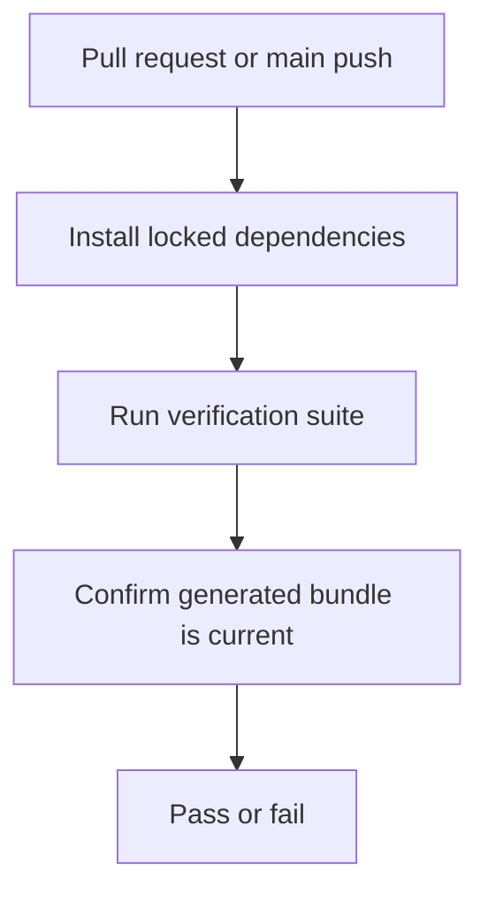

# CI workflow

## Workflow overview

**Purpose:** Verify the Action is formatted, type-safe, tested, and publishable on every pull request and `main` update.
**Trigger events:** Pull requests and pushes to `main`.
**Target environments:** Linux, macOS, and Windows hosted runners.

## Execution flow

## Requirements matrix

| ID | Requirement | Priority | Acceptance criteria |
| --- | --- | --- | --- |
| CI-001 | Validate the Action on all supported runner families. | High | Each runner completes the verification suite. |
| CI-002 | Prevent stale published runtime bundles. | High | The generated `dist/` bundle has no uncommitted difference after verification. |
| CI-003 | Install exactly locked dependencies. | High | Dependency installation rejects lockfile drift. |

## Execution constraints

| Area | Constraint |
| --- | --- |
| Permissions | Read repository contents only. |
| Concurrency | Each operating-system verification is independent; failures do not cancel the other platforms. |
| Network | Dependency installation requires registry access. |

## Error handling and quality gates

| Failure | Result | Recovery |
| --- | --- | --- |
| Formatting, lint, type, test, or build failure | The affected platform check fails. | Correct the source or toolchain contract and rerun CI. |
| Generated bundle differs | The affected platform check fails. | Regenerate and commit `dist/`. |

## Validation criteria

- Every pull request must have successful verification checks for all configured platforms before merge.
- Every `main` push must prove the committed bundle matches its source.

## Related specifications

- [Conventional Commits workflow](spec-process-cicd-conventional-commits.md)
- [Dependency Review workflow](spec-process-cicd-dependency-review.md)
