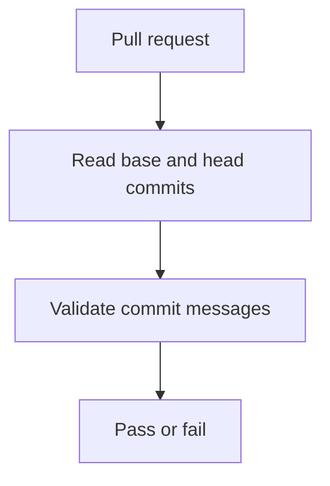

# Conventional Commits workflow

## Workflow overview

**Purpose:** Enforce a parseable commit history for every pull request to `main`.
**Trigger events:** Pull requests targeting `main`.
**Target environments:** Linux hosted runner.

## Execution flow

## Requirements matrix

| ID | Requirement | Priority | Acceptance criteria |
| --- | --- | --- | --- |
| CC-001 | Validate every commit introduced by the pull request. | High | The full range from base SHA through head SHA is checked. |
| CC-002 | Apply the repository Conventional Commits policy. | High | Every message is accepted by the committed configuration. |

## Execution constraints

| Area | Constraint |
| --- | --- |
| Permissions | Read repository contents only. |
| Repository history | Full commit history must be available to compare the pull request range. |
| Secrets | None. |

## Error handling and quality gates

| Failure | Result | Recovery |
| --- | --- | --- |
| Invalid commit message | The pull request check fails. | Amend the branch with a compliant history. |
| Missing history range | The check fails. | Restore access to the pull request base and head history. |

## Validation criteria

- The required `Conventional Commits` check succeeds only when every pull request commit complies.

## Related specifications

- [CI workflow](spec-process-cicd-ci.md)
- [Release PR process](spec-process-cicd-release-pr.md)
