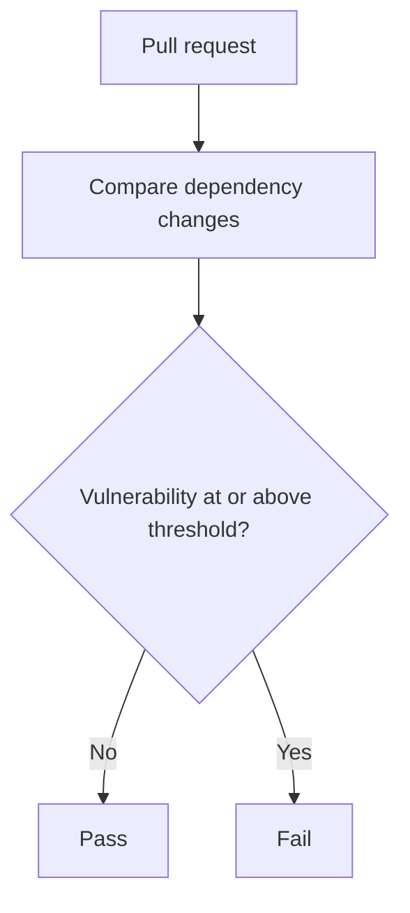

# Dependency Review workflow

## Workflow overview

**Purpose:** Prevent pull requests from introducing dependencies with moderate, high, or critical known vulnerabilities.
**Trigger events:** Pull requests targeting `main`.
**Target environments:** Linux hosted runner.

## Execution flow

## Requirements matrix

| ID | Requirement | Priority | Acceptance criteria |
| --- | --- | --- | --- |
| DR-001 | Review dependency changes in every eligible pull request. | High | A Dependency Review check is produced. |
| DR-002 | Reject known vulnerabilities of moderate severity or higher. | High | The check fails when the configured threshold is met. |

## Execution constraints

| Area | Constraint |
| --- | --- |
| Permissions | Read repository contents only. |
| Scope | Dependency changes in pull requests to `main`. |
| Secrets | None. |

## Error handling and quality gates

| Failure | Result | Recovery |
| --- | --- | --- |
| Disallowed vulnerable dependency | The pull request check fails. | Upgrade, replace, or remove the dependency. |
| Review service unavailable | The pull request check does not pass. | Rerun after the service recovers. |

## Validation criteria

- The required `Dependency Review` check succeeds only when no changed dependency violates the severity threshold.

## Related specifications

- [CI workflow](spec-process-cicd-ci.md)
- [Security policy](../../SECURITY.md)
