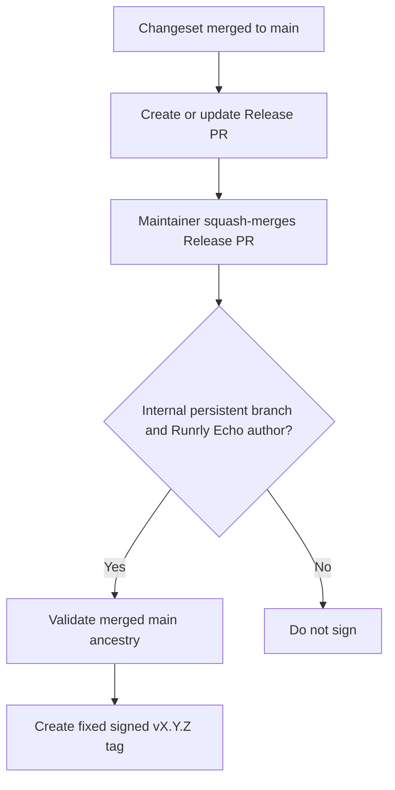

# Release PR and fixed-tag process

## Workflow overview

**Purpose:** Convert approved Changesets into a reviewable version PR and an immutable, SSH-signed stable tag.
**Trigger events:** Pushes to `main` and closure of pull requests targeting `main`.
**Target environments:** Linux hosted runner; `release-signing` for tag creation.

## Execution flow

## Jobs and dependencies

| Workflow | Job | Purpose | Dependency |
| --- | --- | --- | --- |
| Changesets | Create or update Release PR | Aggregate pending consumer-visible changes. | Push to `main`. |
| Release tag | Classify Release PR | Identify the trusted merge eligible for signing. | Closed pull request. |
| Release tag | Create signed release tag | Create and verify the fixed tag. | Successful classification and environment approval. |

## Requirements matrix

| ID | Requirement | Priority | Acceptance criteria |
| --- | --- | --- | --- |
| RP-001 | Consumer-visible changes declare SemVer impact. | High | Pending Changesets produce a Release PR with version and changelog updates. |
| RP-002 | Reuse a persistent branch named `changeset-release/main`. | High | Release PR branch remains available after merge. |
| RP-003 | Sign only trusted internal Release PR merges. | High | The branch, repository, author, merge status, and `main` ancestry are validated. |
| RP-004 | Create only stable fixed tags. | High | A valid release creates one annotated SSH-signed `vX.Y.Z` tag. |

## Security and execution constraints

| Area | Constraint |
| --- | --- |
| Identity | Release PR and tag writes use the Runrly Echo GitHub App. |
| Secrets | App credentials and signing key are available only to the applicable jobs. |
| Approval | Tag creation requires the `release-signing` environment. |
| Permissions | Write permissions are limited to the jobs that create the Release PR or tag. |

## Error handling and quality gates

| Failure | Result | Recovery |
| --- | --- | --- |
| No pending Changesets | No Release PR change is required. | Add a fragment for the next consumer-visible change. |
| Untrusted closed pull request | Tag job is skipped. | Use the persistent branch and Runrly Echo release identity. |
| Invalid version or ancestry | Tag creation fails. | Correct the Release PR and rerun from a valid merge. |

## Validation criteria

- A trusted merged Release PR produces exactly one verified fixed tag matching the package version.
- A non-Release PR never receives a signed release tag.

## Related specifications

- [Release publication process](spec-process-cicd-release-publication.md)
- [Conventional Commits workflow](spec-process-cicd-conventional-commits.md)
