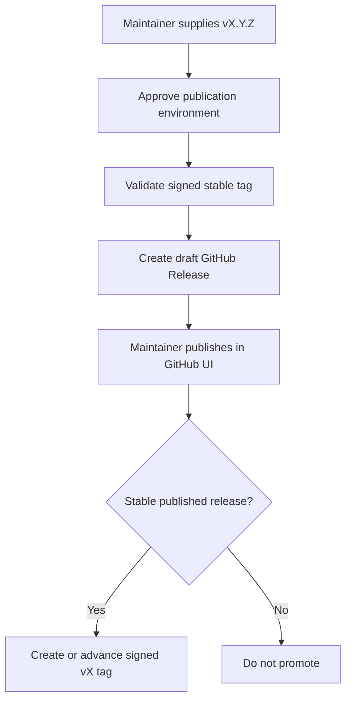

# Release publication and major-tag process

## Workflow overview

**Purpose:** Create an approved draft GitHub Release from a signed fixed tag and promote the signed major alias only after publication.
**Trigger events:** Manual release dispatch and publication of a GitHub Release.
**Target environments:** Linux hosted runner; `release-publication` for draft creation and `release-signing` for major-tag promotion.

## Execution flow

## Jobs and dependencies

| Workflow | Job | Purpose | Dependency |
| --- | --- | --- | --- |
| Release | Create draft | Validate a fixed tag and create an unpublished Release. | Manual dispatch and environment approval. |
| Promote major tag | Classify published release | Restrict promotion to stable fixed versions. | `release.published` event. |
| Promote major tag | Create signed major tag | Create or advance the corresponding `vX` tag. | Successful classification and signing approval. |

## Requirements matrix

| ID | Requirement | Priority | Acceptance criteria |
| --- | --- | --- | --- |
| RL-001 | Accept only existing stable `vX.Y.Z` tags. | High | Prerelease or malformed tags are rejected. |
| RL-002 | Validate the tag before publication. | High | The tag is annotated, GitHub-verified, reachable from `main`, and matches the package version. |
| RL-003 | Require a maintainer publication decision. | High | The workflow creates a draft; Marketplace publication occurs in the GitHub UI. |
| RL-004 | Promote only the major alias. | High | Publishing a stable release updates the matching signed `vX` tag and no minor alias. |

## Security and execution constraints

| Area | Constraint |
| --- | --- |
| Approval | Draft creation requires `release-publication`; major-tag promotion requires `release-signing`. |
| Identity | GitHub Release and tag writes use the Runrly Echo GitHub App. |
| Secrets | The SSH signing key is exposed only to the promotion job. |
| Immutability | Fixed tags and published Releases are never replaced by this process. |

## Error handling and quality gates

| Failure | Result | Recovery |
| --- | --- | --- |
| Tag validation failure | No draft Release is created. | Select or repair a valid fixed tag. |
| Existing Release | Draft creation fails without overwriting it. | Inspect the existing Release before retrying. |
| Prerelease publication | Major-tag promotion is skipped. | Publish a stable fixed release to promote `vX`. |

## Validation criteria

- A draft Release can be created only from a valid fixed signed tag.
- Publishing a stable Release creates or advances only its matching signed major alias.

## Related specifications

- [Release PR and fixed-tag process](spec-process-cicd-release-pr.md)
- [Security policy](../../SECURITY.md)
