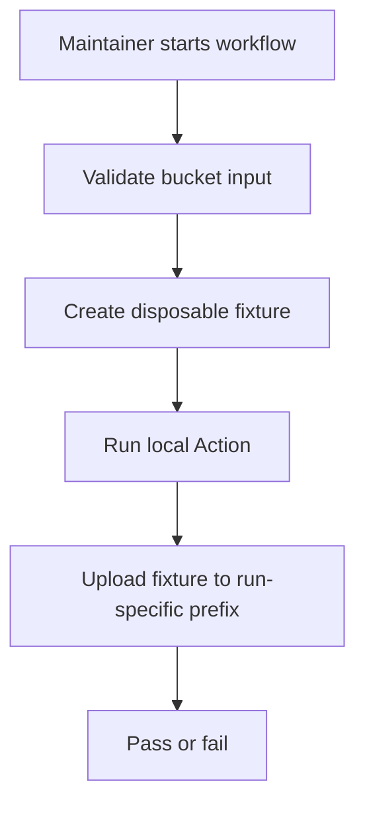

# Supabase integration workflow

## Workflow overview

**Purpose:** Manually verify that the published Action uploads a real fixture to a disposable Supabase Storage bucket.
**Trigger events:** Manual dispatch with a bucket name.
**Target environments:** Linux hosted runner and a preconfigured Supabase project.

## Execution flow

## Input and secret contracts

| Type | Name | Purpose |
| --- | --- | --- |
| Input | `bucket` | Existing disposable bucket used for this run. |
| Secret | `SUPABASE_URL` | Target Supabase project URL. |
| Secret | `SUPABASE_KEY` | Credential authorized to upload to the bucket. |

## Requirements matrix

| ID | Requirement | Priority | Acceptance criteria |
| --- | --- | --- | --- |
| SI-001 | Require an explicit disposable bucket. | High | The run cannot start without the bucket input. |
| SI-002 | Avoid collisions between runs. | High | Each upload uses a run-specific object-key prefix. |
| SI-003 | Exercise the repository Action rather than a published reference. | High | The workflow executes the checked-out Action source and bundle. |

## Execution constraints

| Area | Constraint |
| --- | --- |
| Permissions | Read repository contents only. |
| Network | Requires access to Supabase Storage. |
| Cleanup | The supplied bucket must be disposable; the workflow does not delete uploaded objects. |

## Error handling and quality gates

| Failure | Result | Recovery |
| --- | --- | --- |
| Missing or invalid credentials | The upload fails. | Correct repository secrets. |
| Bucket unavailable or unauthorized | The upload fails. | Configure the bucket and Storage policy, then rerun. |

## Validation criteria

- A successful run uploads the fixture under its run-specific prefix without exposing credentials in logs.

## Related specifications

- [CI workflow](spec-process-cicd-ci.md)
- [Action input contract](../../action.yml)
